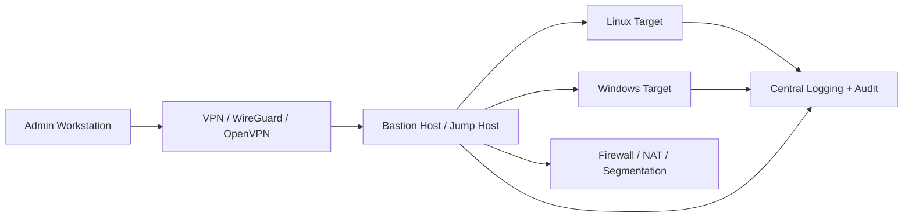

# Secure Remote Administration Lab

Repositori ini berisi panduan untuk membangun lab administrasi jarak jauh yang aman menggunakan perangkat lunak yang memang dirancang untuk administrasi komputer milik sendiri, dengan autentikasi yang kuat dan kontrol akses yang jelas.

Tujuan utama lab ini adalah membangun lingkungan yang sah, terukur, dan aman untuk mengakses mesin yang Anda kelola sendiri, bukan layanan yang mengaburkan tanggung jawab akses atau mengandalkan alat remote desktop yang tidak dapat dipertanggungjawabkan.

## Fokus lab

- Administrasi jarak jauh yang sah dan terkontrol
- Autentikasi berbasis kunci dan/atau MFA
- Jaringan privat atau tunnel terenkripsi
- Pembatasan akses berdasarkan peran dan perilaku
- Logging, audit, dan pemantauan
- Hardened configuration untuk SSH, RDP, VNC, dan WinRM

## Prinsip utama

1. Gunakan software resmi dan tujuan jelas
   - OpenSSH
   - WireGuard atau OpenVPN
   - xrdp / FreeRDP / Microsoft Remote Desktop
   - VNC dengan autentikasi yang benar
   - WinRM/PowerShell Remoting
2. Jangan menggunakan remote access yang tidak dikelola, tidak terverifikasi, atau tidak memiliki dokumentasi keamanan yang jelas.
3. Selalu aktifkan kunci publik, bukan password, untuk akses administratif.
4. Batasi akses hanya dari bastion host atau jaringan VPN pribadi.
5. Hilangkan akses lama dan audit semua sesi.

## Topologi lab

## Stack yang direkomendasikan

### 1. Akses aman ke jaringan internal
- WireGuard: solusi ringkas dan cepat untuk tunnel pribadi
- OpenVPN: pilihan stabil untuk jaringan virtual privat

### 2. Akses remote ke server Linux
- OpenSSH dengan kunci publik
- Fail2Ban
- sudoers yang dibatasi
- auditd / journald

### 3. Akses remote ke sistem Windows
- Windows Remote Desktop (RDP) dengan NLA aktif
- FreeRDP / xfreerdp untuk klien Linux
- WinRM dengan PowerShell Remoting terproteksi

### 4. Akses desktop GUI bila diperlukan
- xrdp untuk Linux desktop yang dibutuhkan
- VNC dengan sandi kuat dan akses terbatas
- Hindari membuka port GUI publik ke internet

## Hardware dan lingkungan

Laboratorium dapat dibangun dalam satu mesin fisik atau virtual dengan beberapa VM seperti:

- Bastion host (Ubuntu Server / Debian)
- Target Linux (Ubuntu Server / Debian / Rocky)
- Target Windows (Windows Server atau Windows 10/11 pro untuk lab)
- Firewall / router virtual (OPNsense / pfSense / nftables)
- Syslog / SIEM lokal (optional: Graylog, Kiwi Syslog, Loki, Splunk Community)

## Persyaratan minimal

- 1 mesin admin (Fisik/VM)
- 1 bastion VM
- 2 VM target (Linux + Windows)
- Jaringan NAT atau bridged internal
- Akses ke internet untuk pembaruan paket

## Rencana keamanan lab

- Non-root account untuk administrasi
- SSH key-based authentication
- Disable password login
- Penyegelan port: hanya bastion yang dapat masuk
- Firewall rules minimal
- VPN sebelum akses internal
- MFA jika memungkinkan (YubiKey, pam_google_authenticator, Azure AD, Duo, atau IdP lokal)
- Semua sesi dicatat dan dipantau

## Struktur repositori

- `docs/` — panduan teknis dan arsitektur lab
- `configs/` — contoh konfigurasi aman
- `README.md` — ringkasan proyek

## Mulai dari sini

Silakan lihat dokumen di bawah ini untuk setup lengkap:

- [docs/lab-topology.md](docs/lab-topology.md)
- [docs/remote-admin-stack.md](docs/remote-admin-stack.md)
- [docs/step-by-step.md](docs/step-by-step.md)
- [docs/security-hardening.md](docs/security-hardening.md)

## Catatan penting

Lab ini dirancang untuk penggunaan yang sah, etis, dan sesuai dengan wewenang administrasi Anda. Ini bukan untuk mengeksploitasi sistem pihak lain. Seluruh konfigurasi harus dilakukan hanya pada lingkungan yang Anda miliki atau yang Anda izinkan untuk dikelola.

## Lisensi

Proyek ini disediakan untuk pembelajaran dan demonstrasi lab keamanan administrasi jarak jauh. Gunakan secara bertanggung jawab.
