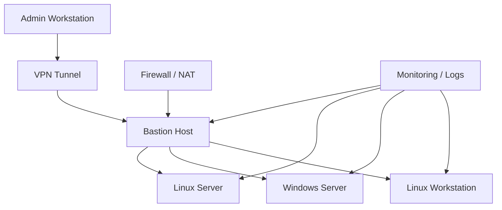

# Topologi Lab Remote Administration yang Aman

Lab ini membangun model administrasi komputer secara aman menggunakan software yang memang dirancang untuk kebutuhan administrasi sistem yang Anda miliki sendiri.

## Tujuan

- Mengelola server dan workstation melalui jaringan yang terkontrol
- Mengunci akses dari internet publik
- Membatasi akses hanya melalui bastion host atau tunnel VPN
- Menyediakan autentikasi yang kuat dan audit logging

## Arsitektur dasar

## Komponen utama

### 1. Admin Workstation
Semua akses diawali dari workstation administrator yang aman.

- Sistem operasi yang diperbarui
- Browser aman untuk admin portal
- SSH client / RDP client / WinRM / FreeRDP
- Kunci SSH dan authenticator jika dibutuhkan

### 2. Bastion Host / Jump Host
Semua koneksi datang melalui bastion host untuk mengurangi permukaan serangan.

- Hanya port tertentu yang dibuka
- Tidak ada aplikasi produksi yang berjalan di sini
- Akses masuk hanya via VPN atau IP tertentu
- Logging akses dan session

### 3. Target Hosts
Target yang dikelola bisa berupa:

- Linux server (Ubuntu, Debian, Rocky)
- Windows server atau workstation
- Raspberry Pi / embedded node jika ada kebutuhan khusus

### 4. Firewall dan segmentasi
- Blok semua port publik kecuali yang benar-benar diperlukan
- Segmentasi antar jaringan berdasarkan fungsi
- Hanya rule minimal yang diizinkan

## Protokol yang aman

### SSH
- Kunci publik saja
- Batasi users yang bisa login
- Gunakan `AllowUsers` atau group-based restriction
- Disable password login
- Bind ke interface VPN jika memungkinkan

### RDP
- Aktifkan Network Level Authentication (NLA)
- Batasi akses ke bastion atau VPN
- Sediakan port 3389 hanya pada jaringan internal
- Gunakan VPN sebelum RDP

### WinRM / PowerShell Remoting
- Gunakan HTTPS jika memungkinkan
- Proteksi dengan autentikasi kuat
- Gunakan host allowlist

### VNC
- Jangan membuka publik
- Gunakan SSH tunnel atau VPN
- Hanya untuk kebutuhan GUI yang benar-benar diperlukan

## Model akses yang disarankan

### Akses terbaik
- Admin dari workstation lokal
- Koneksi terenkripsi ke VPN
- Bastion host sebagai satu-satunya pintu masuk
- Akses ke target hanya melalui bastion

### Akses yang harus dihindari
- Port 22, 3389, 5900, 5985 dibuka ke internet public
- Password admin yang sama di banyak mesin
- User root / admin login langsung dari internet
- Remote management yang tidak terdokumentasi

## Contoh policy keamanan

- Semua akun administratif harus memakai SSH key
- Password hanya untuk akun lokal yang tidak bisa diakses dari jaringan
- Gunakan MFA untuk login ke bastion
- Aktivasi logging `sudo`, `ssh`, `rdp`, `winrm`
- Rotasi kunci secara berkala

## Topik lanjutan

- MFA untuk bastion dan VPN
- SELinux / AppArmor hardening
- Fail2ban dan audit log
- Backup konfigurasi remote access
- Monitoring aktivitas setiap sesi

## Catatan

Proyek ini berguna untuk pembelajaran keamanan operasional dan administrasi sistem yang sah. Semua konfigurasi harus dijalankan di lingkungan yang Anda kendalikan atau miliki izin untuk menguji.
